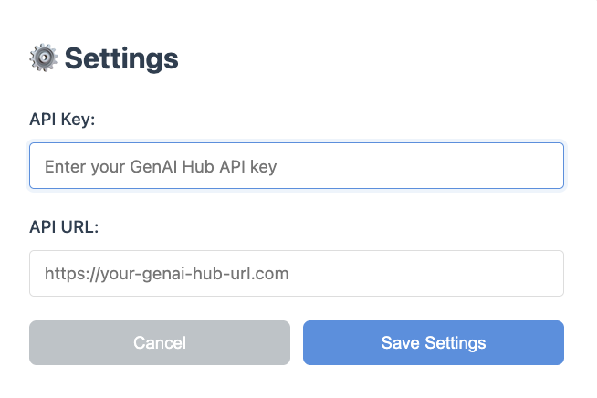
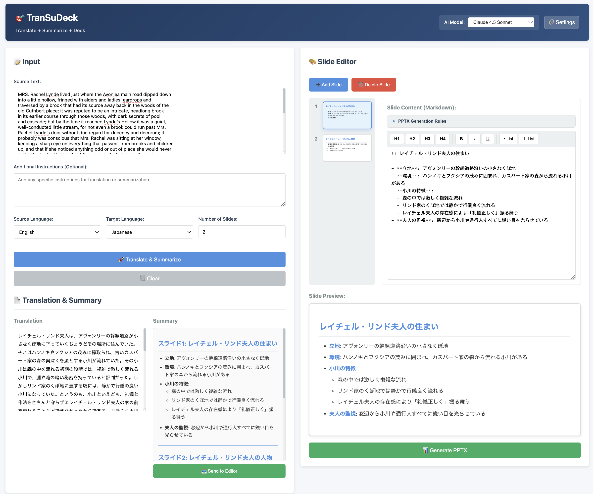

# TranSuDeck

Translation, Summarization & PPTX Generation Application using GenAI Hub

## Overview

TranSuDeck is a web application that leverages GenAI Hub to perform text translation, summarization, and PowerPoint presentation generation.

## UI Screenshots

### API Settings Screen (First Launch)


### Main UI Screen


## Features

- **Translation**: Multilingual text translation (10 languages supported)
- **Summarization**: Automatic summarization of long texts
- **PPTX Generation**: Automatic PowerPoint file generation
- **Model Selection**: Choose from Claude, Llama, and more
- **Initial Setup**: Automatic settings save via API configuration screen

## Supported Languages

| Language | Code |
|----------|------|
| English | en |
| Japanese | ja |
| Korean | ko |
| Chinese | zh |
| French | fr |
| German | de |
| Spanish | es |
| Hindi | hi |
| Vietnamese | vi |
| Thai | th |

## Requirements

- Docker & Docker Compose
- GenAI Hub API access

## 🚀 Quick Start (For Users)

### Using Image from GitHub Container Registry

1. Pull Docker image:
```bash
   docker pull ghcr.io/kotaokayama/transudeck:latest
```

2. Start container:
```bash
   docker run -d -p 8001:8001 --name transudeck ghcr.io/kotaokayama/transudeck:latest
```

   - To change the access port, modify only the left port number (host side)
   - Example: -p 8080:8001 to access via port 8080

3. Access the application:
   - Open http://localhost:8001 in your browser
   - Configure API Key and API URL on first launch

4. Stop container:
```bash
   docker stop transudeck
```

5. Start container (subsequent launches):
```bash
   docker start transudeck
```

6. Remove container:
```bash
   docker rm transudeck
```

   Note: Removing the container will also delete settings and generated files

## Quick Start (For Developers)

### Using Docker

Clone repository:
```bash
git clone <repository-url>
cd TranSuDeck
```

Start:
```bash
docker-compose up -d --build
```

Check logs:
```bash
docker-compose logs -f
```

Access http://localhost:8001 in your browser

### Local Environment

Create and activate virtual environment:
```bash
python -m venv venv
source venv/bin/activate
For Windows: venv\Scripts\activate
```

Install dependencies:
```bash
pip install -r requirements.txt
```

Start application:
```bash
python -m uvicorn app.main:app --host 0.0.0.0 --port 8001 --reload
```

## Usage

1. Access http://localhost:8001 in your browser
2. API settings screen will appear on first launch
3. Enter GenAI Hub API Key and endpoint URL
4. Click "Save Settings"
5. Select a model on the main screen
6. Enter text and click "Translate & Summarize"
7. Send summary results to slide editor with "Send to Editor"
8. After editing slides, click "Generate PPTX" to create PowerPoint file

## Environment Variables

Settings are automatically saved via the initial configuration screen.

In Docker environment, saved to /app/config/.env, in local environment to .env

### Main Configuration Items

| Variable | Description | Required |
|----------|-------------|----------|
| GENAI_API_KEY | GenAI Hub API Key | ✓ |
| GENAI_API_URL | GenAI Hub API Endpoint URL | ✓ |

## Project Structure

```
TranSuDeck/
├── app/
│ ├── core/ # Translation, Summarization, PPTX generation
│ │ ├── init.py
│ │ ├── translator.py
│ │ ├── summarizer.py
│ │ └── pptx_generator.py
│ ├── models/ # Data models
│ │ ├── init.py
│ │ └── slide.py
│ ├── utils/ # Utilities
│ │ ├── init.py
│ │ └── helpers.py
│ ├── static/ # HTML/CSS/JS
│ │ ├── index.html
│ │ ├── css/
│ │ │ └── style.css
│ │ └── js/
│ │ └── app.js
│ ├── config.py # Configuration
│ └── main.py # Main application
├── tests/ # Tests
│ ├── init.py
│ └── test_main.py
├── docker/ # Docker files
│ ├── Dockerfile
│ └── Dockerfile.dev
├── outputs/ # Generated files output
├── logs/ # Logs
├── .github/
│ └── workflows/
│ └── ci.yml # CI/CD configuration
├── docker-compose.yml # Docker configuration
├── requirements.txt # Dependencies
├── requirements-dev.txt # Development dependencies
├── .env.example # Environment variables example
├── .gitignore
├── README.md
└── README_JP.md
```

## 🧪 Testing

### Run Tests

Run all tests:
```bash
make test
```

Or:
```bash
pytest
```

## Troubleshooting

### Common Issues

1. API Configuration Issues:
   - Verify API Key and API URL are correctly configured
   - Check API Key permissions
   - Ensure API URL is in correct format (e.g., https://api.example.com/v1)

2. Docker Related Issues:
   - Confirm Docker Desktop is running
   - Check container logs: docker logs transudeck
   - Try rebuilding the container

3. Port Already in Use:
   Use a different port:
   docker run -d -p 8080:8001 --name transudeck ghcr.io/kotaokayama/transudeck:latest

### Reset Settings

Docker environment (GitHub Container Registry):
Remove and restart container:
```bash
docker stop transudeck
docker rm transudeck
docker run -d -p 8001:8001 --name transudeck ghcr.io/kotaokayama/transudeck:latest
```

Docker environment (docker-compose):
```bash
docker-compose down --volumes
docker-compose up -d
```

Local environment:
```bash
rm .env
```

After restarting the app, the API settings screen will be displayed again.

### Models Not Displaying

- Verify API settings are correct
- Check browser console for errors (F12 key)
- Check logs: docker logs transudeck

### Complete Reset (docker-compose)

```bash
docker-compose down --rmi all --volumes --remove-orphans
docker-compose build --no-cache
docker-compose up -d
```

## Security Notes

- Keep your API keys secure
- Use HTTPS in production environments
- Never commit configuration files to Git

## License

MIT License - See LICENSE file for details
